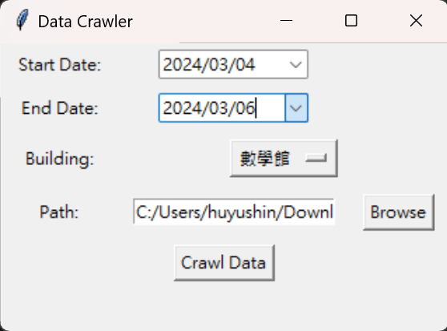
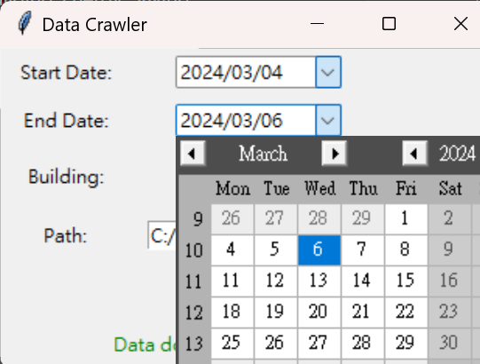
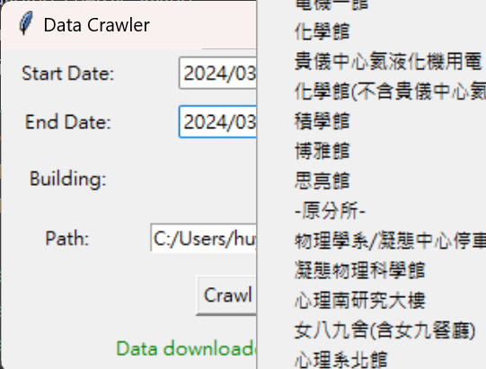
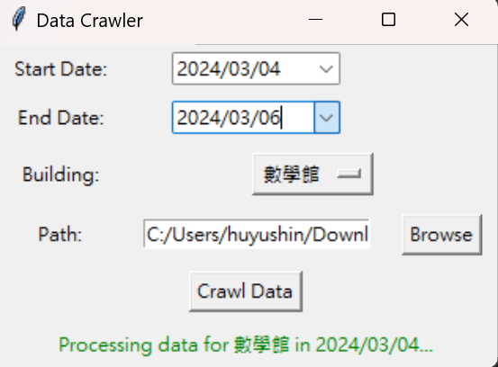
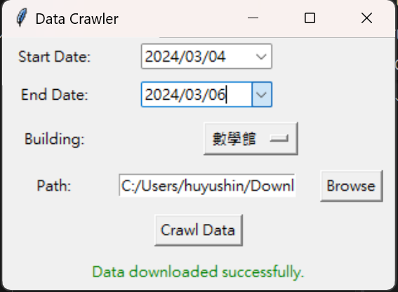
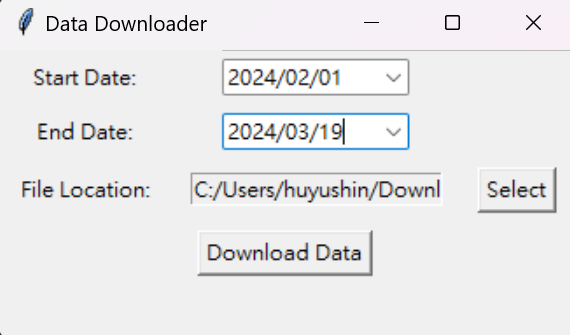
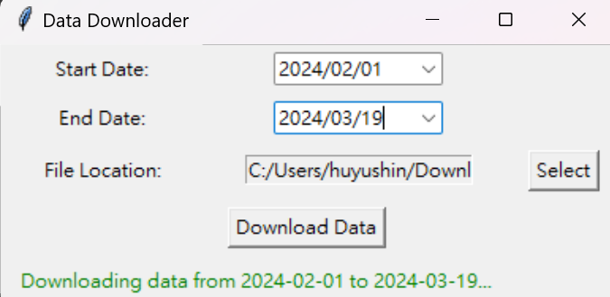
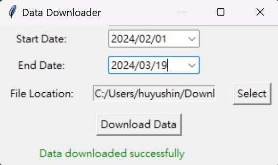
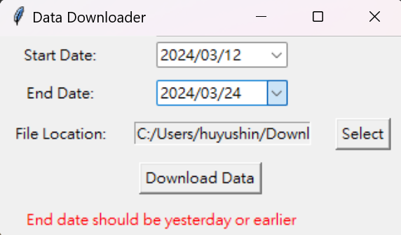
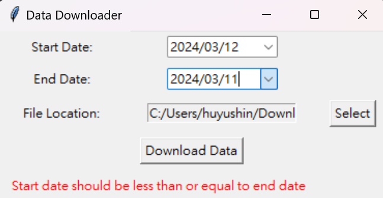

# National Taiwan University (NTU) Data Crawler

- [NTU Electricity Meter Data Crawler](#ntu-electricity-meter-data-crawler)
    - [Download data for all electricity meters in a specific year](#download-data-for-all-electricity-meters-in-a-specific-year)
    - [Download data for a selected building over a specific time](#download-data-for-a-selected-building-over-a-specific-time)
- [NCREE Solar Power Data Crawler](#ncree-solar-power-data-crawler)
    - [Download data for solar power generation data over a specific time](#download-data-for-solar-power-generation-data-over-a-specific-time)

---

## NTU Electricity Meter Data Crawler
**`October 27, 2022 / by Yu-Shin, Hu and Jian Hern Yeoh`**

-   NTU VPN is required to view and retrieve the data.
-   Data is available from 2014/01/01 onwards.
-   Data source: [NTU Digital Meter Monitoring System](https://epower.ga.ntu.edu.tw/?fbclid=IwAR1_crXmTrEojnqGZCh6z2hesnkZ1Bsd7YBEnyAyzEyHOoIvr-xjA8sBAqo)

### Download data for all electricity meters in a specific year

#### Description

-   Run in cmd: `python crawling_meters_data.py`
-   The code is designed for web scraping data from the `電表資料查詢` page of the NTU Campus Digital Electricity Meter Monitoring System.

#### User Interface

|Selecting date and path|Downloading data |Complete|
|-|-|-|
||||

### Download data for a selected building over a specific time

#### Description

-   Run in cmd: `python crawling_buildings_data.py`
-   The code is designed for web scraping data from the `用電統計報表 > 日報表 > 用電分區 - 館舍` page of the NTU Campus Digital Electricity Meter Monitoring System.

#### User Interface

|Selecting date, building, and path|Downloading data |Complete|
| :-----: | :-----: | :-----: |
|      |  <be> |    |

---

## NCREE Solar Power Data Crawler
**`March 24, 2024 / by Yu-Shin, Hu`**

-   Prof.Hsieh's Solar Panel.
-   Data is available from 2017/10/02 onwards.
-   Data sources: available upon request (obtained from [Professor Ying-Chieh Chan's lab](https://yingchiehchan.com/)).

### Download data for solar power generation data over a specific time

#### Description

-   Run in cmd: `python crawling_pv_data.py`, and enter the webpage URL.
-   Web page architecture:
  

#### User Interface

|Selecting date and path|Downloading data |Complete|
| :-----: | :-----: | :-----: |
|  |  <be> |    |

| Warnings |
|----------|
| 

 |

